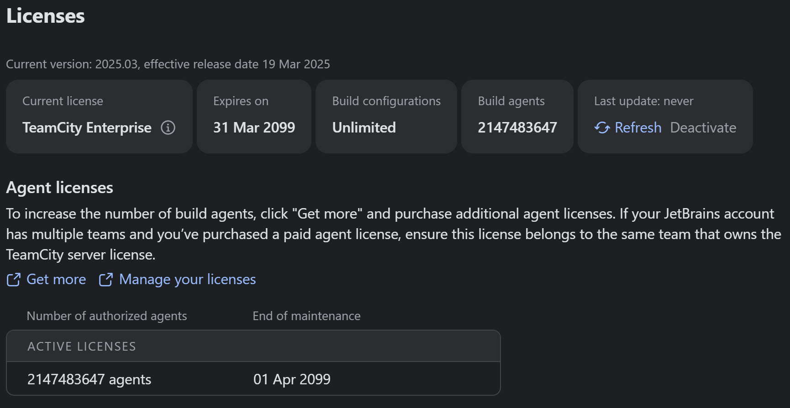

# TeamCityAgent

Unlock enterprise features of TeamCity for free.

**Note**: Commercial use is strictly prohibited. This project is for educational purposes only.

**Note**: Any consequences of using this project shall be borne by the user.

[](https://996.icu)
[](https://github.com/996icu/996.ICU/blob/master/LICENSE)



---

## Usage
Install TeamCity, and then download TeamCityAgent to anywhere you like.
Open TeamCity installation directory and find `bin` folder.
Open `catalina.sh` (or `catalina.bat` for Windows) and add the following line at the start of the file:

```bash
# Linux
export JAVA_OPTS="$JAVA_OPTS -javaagent:/path/to/TeamCityAgent/TeamCityAgent.jar"
```
```bat
rem Windows
set "JAVA_OPTS=%JAVA_OPTS% -javaagent:/path/to/TeamCityAgent/TeamCityAgent.jar"
```

Start TeamCity server, and you are done!

## License

You will need a valid license to unlock the enterprise features of TeamCity. This project is for educational purposes only and should not be used for commercial purposes.
Here is a pre-generated license for you to use:

```
eyJhbGciOiJSUzUxMiIsInR5cCI6IiIsIng1YyI6W119.eyJmb3JtYXRWZXJzaW9uIjoiIiwibGljZW5zZUlEIjoiIiwiaW5zdFB1YktleSI6IkNyYWNrZWQgYnkgbGFtYWRhZW1vbiIsInByb2R1Y3RDb2RlIjoiIiwidHJpYWwiOmZhbHNlLCJwcm9kdWN0TmFtZSI6IlRFQU1DSVRZIiwiY3VzdG9tZXJOYW1lIjoibGFtYWRhZW1vbiIsImJpbGxpbmdQZXJpb2QiOiIiLCJ2YWxpZEZyb20iOiIyMDI1LTA0LTAxVDAwOjAwOjAwKzAwOjAwIiwidmFsaWRUaWxsIjoiMjA5OS0wNC0wMVQwMDowMDowMCswMDowMCIsInZhbGlkaXR5U3RhcnQiOiIyMDI1LTA0LTAxVDAwOjAwOjAwKzAwOjAwIiwidmFsaWRpdHlFbmQiOiIyMDk5LTA0LTAxVDAwOjAwOjAwKzAwOjAwIiwidXNhZ2VNYXgiOiIiLCJsaWNlbnNlVHlwZSI6IkVudGVycHJpc2UiLCJ1cGdyYWRlRHVlRGF0ZSI6IjIwOTktMDQtMDFUMDA6MDA6MDArMDA6MDAiLCJtYWpvclZlcnNpb24iOjEsIm1pbm9yVmVyc2lvbiI6MSwibWF4QWdlbnRzIjoyMTQ3NDgzNjQ3LCJhZ2VudHNVcGdyYWRlRHVlRGF0ZSI6eyJ1bmxpbWl0ZWQiOjIxNDc0ODM2NDd9LCJpYXQiOjE3NDM0NjU2MDAsImV4cCI6NDA3ODc3MTIwMH0.crackedbylamadaemon
```

## Custom License
You can generate your own license using the following instructions.

A license is in JWT format, which has three parts: header, payload, and signature.
They are joined by `.`.
Header and payload are base64 encoded (base64 without `=`) JSON objects, and 
all signature verifications are bypassed, so 
you can write whatever you like in signature part.
There aren't anything for you to customize in header. 
So you can just copy the header from the pre-generated license, or use the following one.

```
eyJhbGciOiJSUzUxMiIsInR5cCI6IiIsIng1YyI6W119
```

First open your web browser and press F12 to open the developer tools.
Then go to the `Console` tab. Edit and run the following code to generate payload.

```javascript
btoa(JSON.stringify({
	formatVersion: "",
	licenseID: "",
	instPubKey: "Cracked by lamadaemon",
	productCode: "",
	trial: false,
	productName: "TEAMCITY",
	customerName: "lamadaemon",
	billingPeriod: "",
	validFrom: "2025-04-01T00:00:00+00:00",
	validTill: "2099-04-01T00:00:00+00:00",
	validityStart: "2025-04-01T00:00:00+00:00",
	validityEnd: "2099-04-01T00:00:00+00:00",
	usageMax: "",
    // Valid licenseType values (choose one): 
    // 'Enterprise', 'OpenSource', 'UnlimitedAgents', 'PerUsageAgents', 'Professional'
    licenseType: "Enterprise",
	upgradeDueDate: "2099-04-01T00:00:00+00:00",
	majorVersion: 1,
	minorVersion: 1,
	maxAgents: 2147483647,
	agentsUpgradeDueDate: {
		"unlimited": 2147483647
	},
	iat: 1743465600,
	exp: 4078771200
})).replaceAll("=", "")
```

## TODOs
- [ ] Support ServerLicense
- [ ] Generic hooks (name independent hooking)
